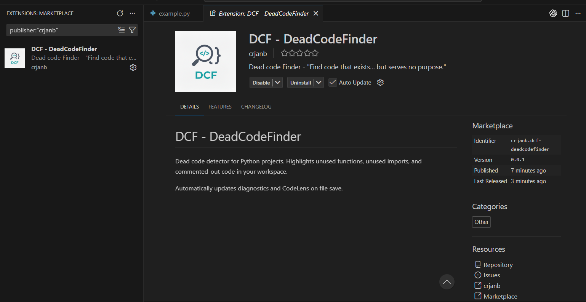
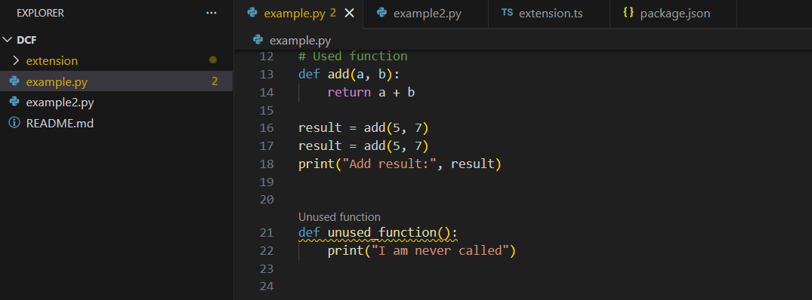

# DCF - DeadCodeFinder

Dead code detector for Python projects. Highlights unused functions, unused imports, and commented-out code in your workspace. 

Automatically updates diagnostics and CodeLens on file save.

## Features

### Unused Functions

### Commented Code
